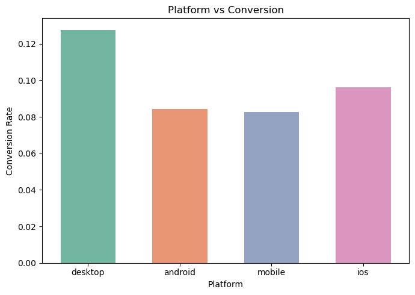
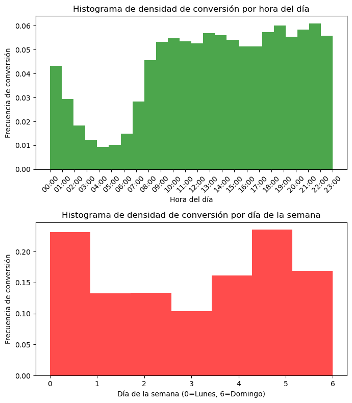

---
title: "Tecnología Digital VI: Inteligencia Artificial - Trabajo Práctico 2"
author: [Federico Giorgi, Gastón Loza Montaña, Tomás Curzio]
geometry: "left=2.5cm,right=2.5cm,top=3cm,bottom=3cm"
lang: "es"
...

# Análisis exploratorio de los datos

Para el análisis de los datos quisimos observar patrones de comportamiendo de los usuarios de la plataforma de e-commerce. Para ello, graficamos la frecuencia de conversión según la plataforma desde la cuál está operando el usuario y la frecuencia de conversión según hora y día de la semana.

{ width=400px }

Entendemos por cómo estaba presentada la información de la plataforma en la que se estaba realizando la visualización que tanto la categoría `android` como `ios` refieren a las aplicaciones nativas de la plataforma en esos sistemas operativos y que `mobile` refiere al uso de la plataforma desde el navegador del dispositivo móbil. Notamos que la conversión en `desktop` es superior a la demás alternativas y que dentro de las opciones de teléfonos, la mayor tasa de conversión se da en dispositivos con el OS de Apple.

{ width=400px }

Del segundo gráfico, nos llama la atención que la tasa de conversión se mantiene bastante estable durante casi todo el día (entre las 9:00 a 23:00) con leves picos en el horario de la salida del horario laboral (18:00) y en la cena u horario de ir a descansar (22:00-23:00).

# Ingeniería de atributos

## Variables adicionales

A pesar de la gran cantidad de atributos con las que cuenta el dateset provisto, nos parecía interesante agregar variables adicionales que puedan aportar al modelo predictivo. Entre ellas se encuentran:

- `discount_%`: tomamos la diferencia procentual entre el precio original y precio.
- `month`, `day`, `day_of_week`, `hour`, `minute`, `second`: desagregación de la variable original `print_server_timestamp`.
- `has_warranty`: a partir la exploración de la variable `warranty` que contiene texto libre con poca estandarización, tomamos aquellas que contengan las palabras "sin" y "garantía", y que no tengan digitos numéricos. A veces se mencionan las palabras "sin" y "garantía" en el texto en otro contexto y mencionan con dígitos numéricos indicando la duración de garantía.
- `tags`: creamos para una columna para cada uno de los tags.
- `category_first` y `category_last`: a partir de la variable `full_name` que indica el nombre de completo de la categoría divido por jerarquía con "-->" decidimos tomar el primer y último nivel de esta jerarquía. Esta decisión la tomamos observando que estas dos eran las más descriptivas de la categoría y usar todos los niveles de jerarquía generaría un nivel excesivo de columna al hacer OHE sobre las mismas.
- `platform`: tomamos la última palabra del string ya que esta es la que más información aportaba.
- `title_emb{i}`: embedings en base a w2v del atributo `title`. En principio hicimos vectores de 300 para hacerle PCA y notamos que con las primeras 100 componentes se explicaba el 90%. Comparamos el AUC-ROC con las primeras 100 componentes principales y contruir los vectores con 100 dimensiones y nos dio mejores resultados lo segundo. Luego al notar que nuestro AUC de validación discrepaba bastante con el del leaderboard pública decidimos bajar las dimensiones a 50 y vimos que funcionó mejor.

## Variables que no aportaban información

Además de agregar variables, decidimos eliminar variables que consideramos que no aportarían al modelo. 

- Decidimos eliminar `accepts_mercadopago` dado que todas las rows tenían la misma información.
- Identificamos que `category_id` y `domain_id` contaban con la misma información, nada más que uno en forma numérica y otra de texto. Además estos atributos coinciden con `full_name`, el cuál ya usamos para crear `category_first` y `category_last`.
- `product_id` creímos que tal vez sería útil hacerle counting pero al comparar con otras versiones modelos notamos que hacerlo no mejoraba, por lo que decidimos eliminarla.
- Los ids restantes también los eliminamos.

# Conjunto de validación

En las clases vimos principalmente tres maneras de realizar conjuntos de validación: `Holdout Set`, `LOOCV`, `K-Fold CV`.

En nuestro modelo decidimos utilizar `Holdout Set`, con una proporción de 70% para entrenar y 30% para validación. Consideramos que, al querer un validation set similar al leaderboard de kaggle, hacer una partición del mismo tamaño podría tener sentido, y además se condice con los estandares vistos en clase.

¿Por qué decidimos hacer `Holdout Set`?

La principal respuesta es tiempo de cómputo. Leave-one-out Cross Validation lo descartamos de entrada pues era inviable con una cantidad de datos tan grande como la del dataset que estamos utilizando. K-fold CV podría ser usado con valores chicos de k, pero de igual manera cada entrenamiento lleva su tiempo, y nos parecía mas útil usar ese tiempo en pensar y aplicar posibles mejoras a nuestro modelo, con una validación que tarde menos pero igualmente sea de calidad, pues hay muchos datos para validar en un 30% de un dataset tan grande, y a su vez no duele tanto perderlos para entrenar como si podría pasar en un dataset pequeño.

Buscabamos además que el validation set no nos arroje resultados muy optimistas por sobre a lo obtenido en el leaderboard y experimentalmente logramos ese efecto de esta manera, por lo que nos pareció razonable utilizarlo de brújula para la construcción de nuestro modelo.

# Modelo predictivo e hiperparámetros

Para empezar, utilizamos un `random forest` muy básico que fue nuestro punto de partida con nuestros commits iniciales, para superar el modelo básico otorgado. No nos enfocamos en optimizar los parametros ya que era simplemente un intento de mejorar un poco el modelo inicial y setear un piso, sin aún haber hecho la ingeniería de atributos mencionada. 

Rápidamente cambiamos el modelo para utilizar la librería `XGBoost`, ya que se mencionó bastante en clase que de los modelos vistos era el mas potente. Empezamos probandolo con el mismo conjunto de datos que el random forest y solo fue ligeramente mejor, pero luego de aplicar la ingeniería de datos mencionada, la diferencia vista fue muy grande (XGBoost nos dio un AUC 9.3% mayor en validation). Descartamos Naive Bayes pues en clase hemos hablado de que es un buen modelo para empezar pero no suele ser lo mejor, y regresión logística, pues al tener tantas columnas si queríamos hacer polinomio 2 se complejizaba demasiado. Esto nos dejo, de los modelos vistos en clase, con XGBoost como modelo a utilizar. 

Para la elección de nuestros hiperparámetros utilizamos la librería `hyperopt`, con el algoritmo de 
[\textcolor{blue}{TPE}](https://towardsdatascience.com/a-conceptual-explanation-of-bayesian-model-based-hyperparameter-optimization-for-machine-learning-b8172278050f), el default de la librería, que utiliza un enfoque Bayesiano. En cada paso intenta construir un modelo probabilistico de la función y elegir los parametros mas prometedores para el siguiente paso. 

Lo hicimos así para un modelo inicial sobre el cual aplicamos algunas modificaciones validando tanto en validation como en el leaderboard público y una vez que tuvimos nuestro modelo final, volvimos a calibrar los parametros con otra pasada de hyperopt (no tantas iteraciones por una cuestión de cómputo), lo cual fue beneficioso para el score.

Utilizamos solo los parámetros vistos en clase, ya que esto nos permitía tener una idea mas clara de cuando podíamos estar overfitteando y cuando no al ir moviendolos. Como finalmente los parámetros de hyperopt nos daban un buen score tanto en validation como en el leaderboard público, consideramos que no estaba haciendo overfitting y no los modificamos. En el leaderboard privado nuestro score aumentó, lo que nos da pie a pensar que esa consideración era correcta.

```
Best Hiperparameters:
{'colsample_by_tree': 0.5918738102818046, 'gamma': 0.012058425899935464, 
'learning_rate': 0.03504176190033326, 'max_depth': 7, 'min_child_weight': 6, 
'n_estimators': 378, 'reg_lambda': 15.162218839683447, 'subsample': 0.6434651515727876}
```

# Análisis Final