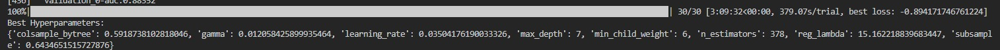

---
title: "Tecnología Digital VI: Inteligencia Artificial - Trabajo Práctico 2"
author: [Federico Giorgi, Gastón Loza Montaña, Tomás Curzio]
date: "04/10/23"
lang: "es"
...

# Análisis exploratorio de los datos

Para el análisis de los datos quisimos observar patrones de comportamiendo de los usuarios de la plataforma de e-commerce. Para ello, graficamos la frecuencia de conversión según la plataforma desde la cuál está operando el usuario y la frecuencia de conversión según hora y día de la semana.

Entendemos por cómo estaba presentada la información de la plataforma en la que se estaba realizando la visualización que tanto la categoría `android` como `ios` refieren a las aplicaciones nativas de la plataforma en esos sistemas operativos y que `mobile` refiere al uso de la plataforma desde el navegador del dispositivo móbil. Notamos que la conversión en `desktop` es superior a la demás alternativas y que dentro de las opciones de teléfonos, la mayor tasa de conversión se da en dispositivos con el OS de Apple.

Del segundo gráfico, nos llama la atención que la tasa de conversión se mantiene bastante estable durante casi todo el día (entre las 9:00 a 23:00) con leves picos en el horario de la salida del horario laboral (18:00) y en la cena u horario de ir a descansar (22:00-23:00).

# Ingeniería de atributos

## Variables que no aportaban información

## Variables adicionales

A pesar de la gran cantidad de atributos con las que cuenta el dateset provisto, nos parecía interesante agregar variables adicionales que puedan aportar al modelo predictivo. Entre ellas se encuentran:

- `discount_%`: tomamos la diferencia 

# Conjunto de validación

En las clases vimos principalmente tres maneras de realizar conjuntos de validación: `Holdout Set`, `LOOCV`, `K-Fold CV`.

En nuestro modelo decidimos utilizar `Holdout Set`, con una proporción de 70% para entrenar y 30% para validación. Consideramos que, al querer un validation set similar al leaderboard de kaggle, hacer una partición del mismo tamaño podría tener sentido, y además se condice con los estandares vistos en clase.

¿Por qué decidimos hacer `Holdout Set`?

La principal respuesta es tiempo de cómputo. Leave-one-out Cross Validation lo descartamos de entrada pues era inviable con una cantidad de datos tan grande como la del dataset que estamos utilizando. K-fold CV podría ser usado con valores chicos de k, pero de igual manera cada entrenamiento lleva su tiempo, y nos parecía mas útil usar ese tiempo en pensar y aplicar posibles mejoras a nuestro modelo, con una validación que tarde menos pero igualmente sea de calidad, pues hay muchos datos para validar en un 30% de un dataset tan grande, y a su vez no duele tanto perderlos para entrenar como si podría pasar en un dataset pequeño.

Buscabamos además que el validation set no nos arroje resultados muy optimistas por sobre a lo obtenido en el leaderboard y experimentalmente logramos ese efecto de esta manera, por lo que nos pareció razonable utilizarlo de brújula para la construcción de nuestro modelo.

# Modelo predictivo

## Hiperparámetros

Para la elección de nuestros hiperparámetros utilizamos la librería `hyperopt`, con el algoritmo de [TPE](https://towardsdatascience.com/a-conceptual-explanation-of-bayesian-model-based-hyperparameter-optimization-for-machine-learning-b8172278050f), el default de la librería, que utiliza un enfoque Bayesiano. En cada paso intenta construir un modelo probabilistico de la función y elegir los parametros mas prometedores para el siguiente paso. 

Lo hicimos así para un modelo inicial sobre el cual aplicamos algunas modificaciones validando tanto en validation como en el leaderboard público y una vez que tuvimos nuestro modelo final, volvimos a calibrar los parametros con otra pasada de hyperopt (no tantas iteraciones por una cuestión de cómputo), lo cual fue beneficioso para el score.

Utilizamos solo los parámetros vistos en clase, ya que esto nos permitía tener una idea mas clara de cuando podíamos estar overfitteando y cuando no al ir moviendolos. Como finalmente los parámetros de hyperopt nos daban un buen score tanto en validation como en el leaderboard público, consideramos que no estaba haciendo overfitting y no los modificamos. En el leaderboard privado nuestro score aumentó, lo que nos da pie a pensar que esa consideración era correcta.

# Análisis Final